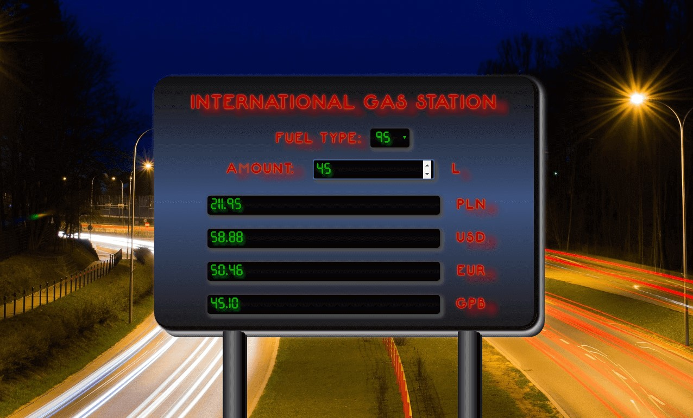

# International-gas-station

First small project in React JS

## General info

I used React (react DOM, babel), html, css.
You can choose the type of fuel and check its price in different currencies.

## Screenshot

## Technologies

- HTML
- CSS
- React v16.6.1
- ReactDOM
- Babel - version 7.3.0

## Setup

[Link to demo version](https://pawelniziolek.github.io/International-gas-station/)

## Status

Project is: _finished_

## Inspiration

Project inspired by cours https://www.udemy.com/kurs-react-od-podstaw/

## Contact

Created by Paweł Niziołek e-mail: pawel.r.niziolek@gmail.com - contact me!
